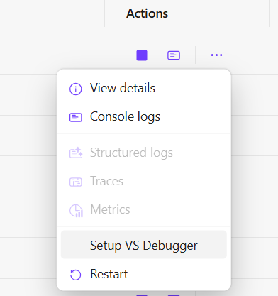

# RY.Aspire.Debugging.Extensions

## Overview

RY.Aspire.Debugging.Extensions is a .NET library that provides an extension method for configuring Visual Studio debugging inside Docker containers. This extension adds a custom command to your Aspire resources, enabling you to install and set up the VS debugger with ease.

Learn more about Aspire custom resource commands [here](https://learn.microsoft.com/en-us/dotnet/aspire/fundamentals/custom-resource-commands).

## Installation

Install the package using the .NET CLI:

```bash
dotnet add package RY.Aspire.Debugging.Extensions
```

## Usage

Below is a basic example of how to use the extension as a custom command in your Aspire resource:

```csharp
using RY.Aspire.Debugging.Extensions;

var builder = DistributedApplication.CreateBuilder(args);

// Configure your Docker container with VS debugging support
var apiContainer = builder.AddDockerfile("my-api", "/path/to/api", "src/WebAPI/Dockerfile")
    .WithVsDebug() // This adds the custom command for VS debugger setup in Aspire
    .WithLifetime(ContainerLifetime.Persistent);

// Build and run the application
builder.Build().Run();
```

Here’s what the **Setup VS Debugger** command looks like in Aspire’s UI:



By clicking on this command, the debugger setup process is initiated inside the Docker container.

## Additional Resources

For more details on how to attach the Visual Studio debugger to processes running inside a container, please refer to the [Visual Studio documentation on attaching to a process](https://learn.microsoft.com/en-us/visualstudio/debugger/attach-to-process-running-in-docker-container?view=vs-2022).

## License

This project is licensed under the MIT License.
